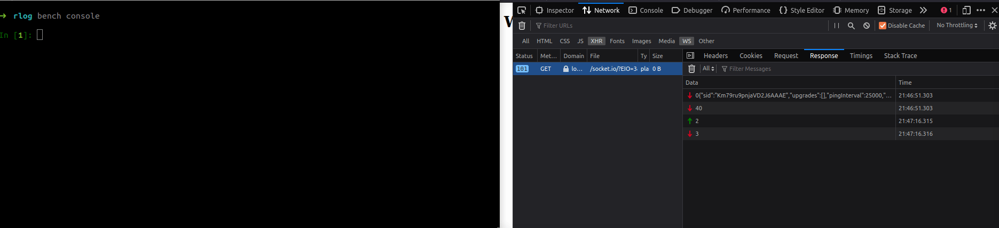
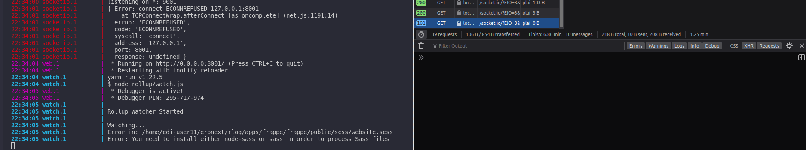

# Fsocket

Extend frappe\'s websocket server using socket.io and redis

## Installation

Use frappe bench to add fsocket in your project

```bash
$ bench get-app https://github.com/pifabs/fsocket.git
```

## Usage
Add "fsocketio_port" key in your common_site_config.json file and set the value to an unused port number
```
{
  ...,
  "fsocketio_port": 9002
}
```

Add the ff. line in your Procfile
```
...

fsocket_server: /usr/bin/node apps/fsocket/socketio.js

...
```

This will automatically launch a socket io server when you run "bench start"
```
...
22:27:01 system           | socketio.1 started (pid=28536)
22:27:02 fsocket_server.1 | listening on *: 9002
22:27:03 socketio.1       | listening on *: 9001
...
```

Now we listen to events emitted by frappe.publish_realtime()
```javascript
...

subscriber.on("message", function (channel, message, room) {
	message = JSON.parse(message);
	if (message.room) {
		io.to(message.room).emit(message.event, message.message);
	} else {
		io.emit(message.event, message.message);
	}
});

...
```



We can also listen to events emitted by the client
```javascript
...

io.on('connection', function (socket) {
	socket.on("msgprint", function(message) {
		console.log("message from client", message);
	});
});
...
```

## Contributing
Pull requests are welcome. For major changes, please open an issue first to discuss what you would like to change.

## License
[MIT](https://choosealicense.com/licenses/mit/)
